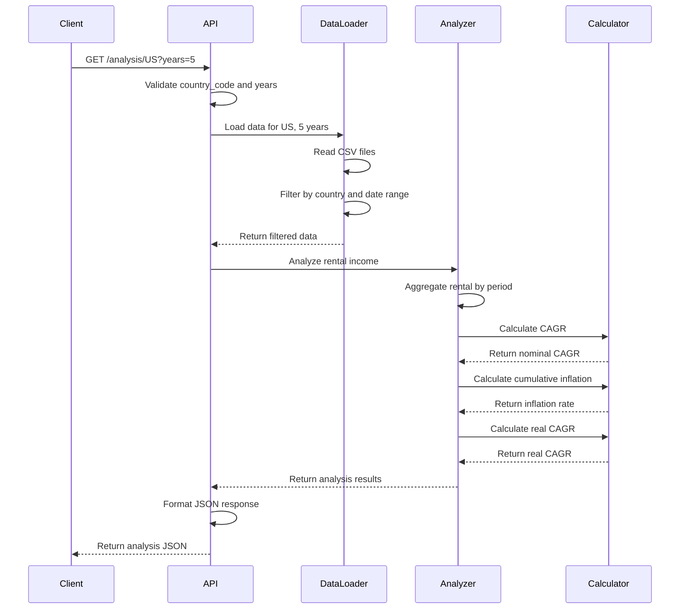

# System Architecture Overview

## High-Level Architecture

```mermaid
graph TB
    Client[API Client] -->|GET /analysis/{country}?years=X| API[FastAPI Service]
    API --> DataLoader[Data Loader]
    DataLoader --> RentalCSV[Rental Data CSV]
    DataLoader --> InflationCSV[Inflation Data CSV]
    DataLoader --> BuildingCSV[Building Data CSV]
    API --> Calculator[CAGR Calculator]
    API --> Analyzer[Analysis Engine]
    Analyzer --> Calculator
    API -->|JSON Response| Client
```

## System Components

### Backend Components

#### **FastAPI Service**
- **Technology**: Python 3.11+, FastAPI framework
- **Purpose**: REST API endpoint for rental income analysis
- **Endpoints**: 
  - `GET /analysis/{country_code}?years={1|3|5|10}`
- **Responsibilities**:
  - Request validation
  - Orchestrate data loading and analysis
  - Format and return JSON responses

#### **Data Loader**
- **Technology**: Python, Pandas
- **Purpose**: Load and parse CSV data files
- **Responsibilities**:
  - Read rental, inflation, and building CSV files
  - Filter data by country and time period
  - Validate data completeness
  - Handle data type conversions

#### **Analysis Engine**
- **Technology**: Python
- **Purpose**: Core business logic for rental income analysis
- **Responsibilities**:
  - Aggregate rental income by time period
  - Calculate nominal growth (CAGR)
  - Calculate cumulative inflation
  - Calculate real (inflation-adjusted) growth
  - Generate analysis summary

#### **CAGR Calculator**
- **Technology**: Python
- **Purpose**: Financial calculations
- **Responsibilities**:
  - Compound Annual Growth Rate calculation
  - Inflation compounding
  - Real return calculation

### Data Layer

#### **File-Based Storage**
- **Technology**: CSV files
- **Purpose**: Store rental, inflation, and building data
- **Files**:
  - `data/rentals.csv`: Monthly tenant rental data
  - `data/inflation.csv`: Monthly country inflation rates
  - `data/buildings.csv`: Building metadata
- **Access Patterns**: Read-only, loaded on-demand per request

## Technology Stack

### Languages
- **Backend**: Python 3.11+

### Frameworks and Libraries
- **API Framework**: FastAPI
- **Data Processing**: Pandas, NumPy
- **Validation**: Pydantic
- **Testing**: Pytest
- **Code Quality**: Black (formatting), Pylint/Ruff (linting)

### Development Tools
- **Package Management**: pip, requirements.txt
- **Virtual Environment**: venv
- **API Testing**: curl, httpie, or Postman

## Data Flow

### Analysis Request Workflow



## Data Models

### CSV Schemas

#### Rental Data (`rentals.csv`)
```
building_id, tenant_id, country_code, month, year, rental_amount, currency
B001, T001, US, 1, 2020, 5000.00, USD
B001, T002, US, 1, 2020, 3500.00, USD
```

#### Inflation Data (`inflation.csv`)
```
country_code, year, month, inflation_rate
US, 2020, 1, 0.0021
US, 2020, 2, 0.0018
```
- `inflation_rate`: Monthly inflation rate (e.g., 0.0021 = 0.21% monthly)

#### Building Data (`buildings.csv`)
```
building_id, country_code, name, property_type, city
B001, US, Downtown Plaza, Office, New York
B002, US, Retail Center, Retail, Los Angeles
```

### API Response Model

```json
{
  "country_code": "US",
  "analysis_period_years": 5,
  "date_range": {
    "start_date": "2019-01",
    "end_date": "2024-01"
  },
  "rental_income": {
    "start_period_total": 1250000.00,
    "end_period_total": 1450000.00,
    "currency": "USD"
  },
  "growth_metrics": {
    "nominal_cagr_percent": 3.02,
    "cumulative_inflation_percent": 12.5,
    "real_cagr_percent": -1.8
  },
  "portfolio_summary": {
    "buildings_analyzed": 45,
    "total_months": 60
  }
}
```

## Performance Considerations

### Scalability
- **Current Scale**: 1,400 buildings, 20 countries, 10 years of data
- **Expected Load**: Low-frequency queries (on-demand analysis)
- **Data Volume**: ~168,000 rental records per year (1,400 buildings × 12 months × avg 10 tenants)
- **Response Time Target**: < 2 seconds per analysis request

### Optimization Strategies
- **Data Caching**: Cache loaded CSV data in memory for repeated queries
- **Efficient Filtering**: Use Pandas for optimized data filtering
- **Lazy Loading**: Only load data for requested country and time period

## Development Practices

### Code Organization
```
rental-analysis-service/
├── src/
│   ├── api/
│   │   ├── __init__.py
│   │   ├── main.py              # FastAPI app
│   │   └── routes.py            # API endpoints
│   ├── services/
│   │   ├── __init__.py
│   │   ├── data_loader.py       # CSV data loading
│   │   ├── analyzer.py          # Analysis engine
│   │   └── calculator.py        # CAGR calculations
│   ├── models/
│   │   ├── __init__.py
│   │   └── schemas.py           # Pydantic models
│   └── utils/
│       ├── __init__.py
│       └── validators.py        # Input validation
├── tests/
│   ├── unit/
│   ├── integration/
│   └── fixtures/
├── data/
│   ├── rentals.csv
│   ├── inflation.csv
│   └── buildings.csv
├── requirements.txt
└── README.md
```

### Testing Strategy
- **Unit Tests**: Test individual functions (calculator, validators)
- **Integration Tests**: Test API endpoints with sample data
- **Test Coverage Target**: > 80%
- **Test Data**: Use generated test data (50 buildings, 5 countries)

### Quality Assurance
- **Code Formatting**: Black
- **Linting**: Ruff or Pylint
- **Type Checking**: MyPy (optional)
- **API Testing**: Pytest with FastAPI TestClient

## Architectural Decision Records (ADRs)

### Key Decisions
- [ADR-001: Python and FastAPI for Service Implementation](decisions/ADR-001-python-fastapi.md)
- [ADR-002: File-Based Storage for Initial Implementation](decisions/ADR-002-file-storage.md)
- [ADR-003: CAGR Methodology for Growth Calculation](decisions/ADR-003-cagr-methodology.md)

---

**Last Updated**: 2025-11-07  
**Next Review**: After initial implementation  
**Document Owner**: Development Team
